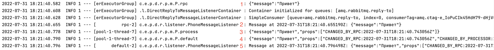

# Тестовое задание
***

Приложение написано на стеке:

* Apache Camel 3.18
* Apache Camel Rest
* Apache Camel Netty
* Spring Boot
* RabbitMQ

## Модули приложения
### [phone-message-divided-route-chain](./phone-message-divided-route-chain/)
***
Цепочка маршрутов разделена на классы

_[Описание работы](#explanation)_

1. [RestPhoneMessageRoute](./phone-message-divided-route-chain/src/main/java/com/example/phone_message/divided_route_chain/route/phone/message/RestPhoneMessageRoute.java) 
2. [PhoneMessageOkResponseRoute](./phone-message-divided-route-chain/src/main/java/com/example/phone_message/divided_route_chain/route/phone/message/PhoneMessageOkResponseRoute.java) 
3. [PhoneMessageRpcRequestRoute](./phone-message-divided-route-chain/src/main/java/com/example/phone_message/divided_route_chain/route/phone/message/PhoneMessageRpcRequestRoute.java) 
4. [PhoneMessageProcessRoute](./phone-message-divided-route-chain/src/main/java/com/example/phone_message/divided_route_chain/route/phone/message/PhoneMessageProcessRoute.java)
5. [PhoneMessageDefaultRequestRoute](./phone-message-divided-route-chain/src/main/java/com/example/phone_message/divided_route_chain/route/phone/message/PhoneMessageDefaultRequestRoute.java)

### [phone-message-monolith-route-chain](./phone-message-monolith-route-chain/)
***
Цепочка маршрута сосредоточена в одном классе

_[Описание работы](#explanation)_

* [PhoneMessageMonolithRoute](./phone-message-monolith-route-chain/src/main/java/com/example/phone_message/monolith_route_chain/route/phone/message/PhoneMessageMonolithRoute.java)

## Сборка и запуск
***
Есть несколько вариантов сборки и запуска приложения

### Вариант №1
**Использовать Docker, для сборки и запуска приложения**

Потребуется установленный Docker, на машине с которой будет производиться запуск

[Официальный сайт с документацией по установке](https://docs.docker.com/engine/install/)

Далее можно воспользоваться встроенными инструментами IDE или выполнить следующие команды:

**Сборка и запуск сервисов (Detach mode)**
```
docker compose up -d
```
**Сборка и запуск сервисов (Attach mode)**
```
docker compose up
```
**Сборка и запуск сервисов (Принудительная сборка)**
```
docker compose up --build
```
**Подключение к стриму логов, контейнера с приложением**
```
docker compose logs phone-message -f
```

### Вариант №2
**Запуск Standalone приложения**

Потребуется установленные Java 11 и RabbitMQ 3.10

* [Java](https://jdk.java.net/archive/)
* [RabbitMQ](https://www.rabbitmq.com/download.html)

Jar файлы можно найти в разделе релизов

### Вариант №3
**Запуск приложения из IDE**

Потребуется скачать и распаковать архив из ветки master.
Или же, вопспользоваться инструментами IDE и импортировать проект напрямую

Так же понадобится JDK 11 и RabbitMQ 3.10

* [Java](https://jdk.java.net/archive/)
* [RabbitMQ](https://www.rabbitmq.com/download.html)

Далее воспльзоваться встроенными инструментами IDE или выполнить последовательность коммнад из корня нужного модуля, и запустить проект
```
./mvnw clean

./mvnw install

./mvnw compile

./mvnw package

./mvnw exec:java -Dexec.mainClass="com.example.phone_message.[replace_with_module_name].Application"
```

## Тестирование
**Для того, чтобы протестировать приложение, потребуется:**

* Выполнить HTTP POST запрос по адресу http://127.0.0.1:8080/phone-message
с следующим телом запроса в JSON формате:
```json
{
   "message": "your_message"
}
```

Так же можно воспользоваться [коллекцией для Postman](./Phone%20Message.postman_collection.json)

**После выполнения запроса, в логах можно наблюдать следующее:**

1. Приложение получило сообщение из вне по HTTP
2. Сообщение отправлено и доставлено брокеру (RPC)
3. Брокер вернул изменённое сообщение
4. Приложение с помощью Processor изменило сообщение
5. Сообщение отправлено и доставлено брокеру


<a name="explanation"><h2>Описание работы</h2></a>

[1]:[]

**Цепочка маршрута:**

1. Приём HTTP POST запроса на сервер
2. При наличии тела запроса, отвечает пустым сообщнием HTTP 200 OK
3. Отправляет RPC запрос брокеру сообщений
4. Получает ответ от брокера (Следствие RPC запроса)
   и обрабатывает сообщение в Processor
5. Отправляет изменённое сообщение в брокер